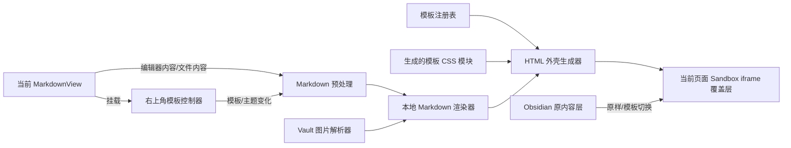

# Obsidian 本地模板预览技术方案

> 状态：待评审
> 分支：`codex/local-template-preview`
> 日期：2026-09-01

## 1. 背景

当前 Share Page 插件只有在发布后，才能看到笔记应用模板后的最终页面。模板渲染能力主要位于 `html2url`：模板注册表、Markdown 渲染规则、主题 class 和 `styles/templates` 下的模板 CSS。

本方案在 Obsidian 插件内增加本地模板预览。用户打开一篇笔记后，可以在 Obsidian 内切换模板和主题并立即查看效果，不创建分享链接、不写入服务端数据库、不上传本地图片。

## 2. 目标与非目标

### 2.1 目标

- 预览当前打开的 Markdown 笔记，包括尚未发布的笔记。
- 在 Obsidian 内切换模板、主题后即时刷新。
- 预览过程不调用发布 API，不生成 slug，不写分享记录和 frontmatter。
- 预览过程不上传笔记正文或本地图片。
- 复用 `html2url` 的模板 CSS、模板 class 和 Markdown 规则，使预览尽量接近发布结果。
- 模板样式与 Obsidian 主题隔离，避免污染编辑器和其他插件。
- 保持官方 Community Plugins 的标准发布产物：`main.js`、`manifest.json`、`styles.css`。

### 2.2 非目标

- 第一阶段不把整个 Next.js/React 应用嵌入插件。
- 第一阶段不提供在线协作、版本历史、密码保护和分享链接管理。
- 第一阶段不修改 `html2url` 后端接口或数据库。
- 第一阶段不保证 KaTeX、自定义 CSS、Dataview 动态查询等扩展能力完全一致；Mermaid 已在本地预览中通过插件内置渲染补齐。

## 3. 方案选择

| 方案 | 优点 | 问题 | 结论 |
| --- | --- | --- | --- |
| 直接给 Obsidian Reading View 加模板 CSS | 改动少 | DOM 结构不一致，易受主题和其他插件影响，难以还原发布页 | 不采用 |
| 调用服务端“仅预览”接口 | 最容易与网站一致 | 笔记仍会发送到服务器，离线不可用 | 不采用 |
| 把全部 Next.js/React 模板组件搬进插件 | UI 还原度高 | 依赖和包体过大，维护两套 React 运行环境 | 不采用 |
| 提取静态渲染核心，在插件内生成隔离预览 | 不上传、可离线、与静态发布页结构一致 | 需要同步模板 CSS 和部分渲染规则 | **采用** |

核心原则是：移植渲染能力，不移植网站应用。

## 4. 用户体验

### 4.1 入口与发布入口分离

不新增与“分享/发布”相似的 ribbon 主入口。模板预览入口直接放在每个 Markdown 页面的右上角：

- `模板`下拉框：第一项为“Obsidian 原样”，后面是 33 个模板。
- `主题`下拉框：只在当前模板支持多主题时显示。
- 两个下拉框只改变本地显示，不调用发布逻辑。
- 原有 ribbon、命令和右键菜单继续只负责发布，避免用户混淆“预览”和“已经公开”。

保留一个可被命令面板搜索的辅助命令：`Share Page：切换当前笔记模板预览`。它只负责聚焦右上角控件或切换“Obsidian 原样/上次模板”，不作为主要入口。

### 4.2 当前页面原地预览

不创建独立 `ItemView`，也不打开右侧分栏。插件在当前 `MarkdownView` 内挂载一个轻量预览控制器：

- 控件固定在当前页面内容区域右上角，不占用发布按钮的位置。
- 选择非“Obsidian 原样”模板后，隐藏当前编辑/阅读内容层，在同一页面显示本地模板 iframe。
- 原 MarkdownView 仍保持挂载，不替换 leaf，因此未保存编辑内容和编辑器状态不会丢失。
- 选择“Obsidian 原样”后立即移除预览层，恢复原来的编辑或阅读页面及滚动位置。
- 模板切换只替换 iframe 内容，不切换页面、不打开浏览器。
- 主题下拉框跟随模板变化；无多主题模板不显示空控件。
- 当前笔记内容变化时，预览使用 150–250 ms debounce 自动刷新。
- 用户退出预览时恢复进入预览前的 Markdown 滚动位置；模板之间切换尽量保留预览滚动比例。

控件挂载在 `.view-content` 内的插件自有容器，而不是修改 Obsidian 未公开的标题栏 DOM。这样既能呈现在页面右上角，也能减少 Obsidian 升级造成的兼容风险。

### 4.3 状态反馈

- 首次渲染显示固定高度骨架或“正在生成本地预览”。
- 渲染失败时在预览区域内显示错误和“重试”按钮。
- 下拉框旁以低干扰文本显示“本地 · 未发布”；窄屏下收进控件容器的辅助说明。
- 发布仍通过现有“分享”按钮执行，避免用户误以为预览已经公开。

## 5. 技术架构



### 5.1 模块划分

建议新增：

```text
src/
  template-preview/
    controller.ts           # 按 MarkdownView/leaf 管理挂载、切换和生命周期
    toolbar.ts              # 页面右上角模板/主题下拉框
    renderer.ts             # Markdown -> 安全 HTML -> 完整预览文档
    template-registry.ts    # templateId -> card class / css key / extra classes
    local-images.ts         # 本地图片解析，不上传
    sanitize.ts             # 过滤危险 HTML、属性和协议
    generated/
      template-styles.ts    # 构建前生成并提交，打包进 main.js
      template-assets.ts    # CSS 中引用的小资源/data URI
scripts/
  sync-template-assets.mjs  # 从 html2url 同步模板 CSS 和注册表
tests/
  template-preview/
```

现有文件改动：

- `src/main.ts`：为 MarkdownView 挂载/卸载预览控制器并注册 workspace 事件。
- `src/constants.ts`：复用模板/主题列表，避免产生第三份模板 ID 定义。
- `src/i18n.ts`：增加预览入口、状态、错误和辅助文本。
- `src/publish.ts`：抽离可复用的 Markdown 预处理函数；发布逻辑不改变。
- `styles.css`：只增加 Obsidian 工具栏和视图外壳样式，不放模板 CSS。
- `package.json`：增加本地渲染依赖和模板资源同步脚本。

### 5.2 运行时流程

1. 插件检测已打开的 `MarkdownView`，在其 `.view-content` 内挂载右上角控制器。
2. 用户选择非“Obsidian 原样”的模板，控制器记录当前编辑/阅读模式和滚动位置。
3. 若编辑器仍打开，读取 `editor.getValue()`，确保预览包含未保存修改；否则读取 Vault 文件。
4. 处理 frontmatter、wiki 链接和 Obsidian 图片嵌入。
5. 在插件内将 Markdown 转为 HTML。
6. 根据 `templateId` 读取 card class、extra class、主题和模板 CSS。
7. 生成完整 `srcdoc`，注入公共 CSS、当前模板 CSS 和渲染后的正文。
8. 在当前 `.view-content` 内显示 sandbox iframe 覆盖层，并隐藏原内容层但保持其 DOM 和编辑器实例挂载。
9. 模板或主题变化时只重新生成 `srcdoc`，不调用网络 API；选择“Obsidian 原样”时移除覆盖层并恢复原内容。

## 6. 模板资源复用

### 6.1 单一来源

模板样式的上游来源保持为：

- `html2url/styles/templates/common.css`
- `html2url/styles/templates/<template>.css`
- `html2url/lib/static-markdown-share.ts` 中的模板 class 映射
- `html2url/lib/constants.ts` 中的主题配置

插件仓库不能依赖相邻目录才能构建，因此同步脚本输出的 TypeScript 模块需要提交到 Git。这样 GitHub Actions 和 Obsidian 官方安装流程只使用插件仓库也能完成构建。

### 6.2 同步脚本

`scripts/sync-template-assets.mjs` 负责：

- 校验插件中的 33 个模板 ID 均有 CSS 和 card class。
- 合并 `common.css` 与各模板独有 CSS。
- 将 CSS 压缩并转为字符串模块。
- 内联相对资源；例如 `coil-notebook.css` 的 `/assets/img/coil-bg.png` 需转为 data URI 或改为纯 CSS。
- 生成来源 commit、文件哈希和同步日期，便于判断模板是否落后。
- 对 `byteDance.css`、`neonGlow.css` 等大小写文件名做显式映射，避免 Windows 与 Linux 构建差异。
- 检查 `coil-notebook.css` 与 `coilnotebook.css` 的实际使用关系，避免同步错误文件。

模板 CSS 约 293 KB（未压缩）。打入 `main.js` 后可接受，但需要在实现阶段记录构建前后包体并设置上限。

## 7. Markdown 与图片处理

### 7.1 Markdown

优先与 `html2url/lib/static-markdown-share.ts` 对齐：

- GFM、换行、表格、任务列表。
- 标题 ID、代码块和语言标签。
- 去除 YAML frontmatter。
- 普通 wiki 链接转为显示文本。
- 禁止执行原始 Markdown 中的脚本。

建议使用与网站相同主版本的 `marked`。当前本地预览通过插件内置 `highlight.js` 生成与发布页一致的高亮结构；无语言标记的 SQL 代码也会进行保守识别。

### 7.2 本地图片

- `![[image.png]]` 通过 `metadataCache.getFirstLinkpathDest()` 解析。
- 相对 Markdown 图片通过当前笔记路径解析。
- 使用 Vault 二进制数据生成临时 data URL 或经过验证的本地资源 URL。
- 不调用现有 OSS 上传逻辑，不写 `uploadedAssets` 缓存。
- 视图关闭或笔记切换时释放临时资源。
- 无法解析的图片显示占位说明，不让整个预览失败。

远程图片仍可能向图片原始域名发起请求，这与普通 Markdown 预览一致；插件本身不会把正文发送到 `htmlto.link`。如需严格离线模式，可在后续增加“阻止远程图片”设置。

## 8. 隔离与安全

使用 sandbox iframe，而不是把模板 DOM 直接插入 Obsidian 文档：

- iframe 不启用 `allow-scripts`、`allow-forms`、`allow-top-navigation`。
- 加入 CSP，默认禁止脚本、表单、对象和 frame。
- 只允许内联样式以及允许列表中的图片协议。
- 移除 `<script>`、`<iframe>`、`<object>`、`<embed>`、`<form>`、事件属性和危险 URL 协议。
- 模板 CSS 不能修改 Obsidian 主界面，也不会被第三方 Obsidian 主题覆盖。
- iframe 标题、工具栏标签和错误状态提供可访问文本。

预览路径中不得调用：

- `createSharePage()`
- `rewriteLocalImagesForShare()`
- `requestUrl()`
- `saveNoteShare()`
- `writeShareToFrontmatter()`

## 9. 状态与事件

### 9.1 本地状态

- 模板和主题沿用现有 `settings.templateId`、`settings.themeClass`。
- 切换预览模板时可以保存为下次默认值，但不会触发发布。
- 每个 Markdown leaf 的控制器保存当前是否启用预览、模板、主题、原内容层和预览层滚动位置。
- 默认只持久化最后选择的模板和主题，不持久化正文副本，也不强制让所有笔记自动进入模板预览。
- 重新打开 Obsidian 时笔记仍以原生视图打开，避免插件改变用户的默认阅读/编辑习惯。

### 9.2 事件订阅

- `workspace.active-leaf-change`：可选跟随当前 Markdown 文件。
- `workspace.layout-change`：发现新建、关闭或移动的 Markdown leaf，并挂载/清理控制器。
- `workspace.editor-change`：150–250 ms debounce 后更新预览。
- `vault.modify`：文件在其他位置修改时更新。
- `vault.rename` / `vault.delete`：更新绑定路径或关闭空预览。
- MarkdownView 切换 source/preview 模式时保留插件预览状态；退出模板预览后恢复用户原模式。
- 通过递增 render token 丢弃过期异步结果，避免快速切换模板时旧结果覆盖新结果。

## 10. 性能策略

- 公共 CSS 与各模板 CSS 在插件加载后只解析一次。
- 模板切换只重建当前 iframe，不重复读取未变化的本地图片。
- Markdown 编辑更新使用 debounce，目标 150–250 ms。
- 图片 data URL 按文件路径、mtime、size 做内存缓存，并设置总大小上限。
- 大文档渲染超过阈值时显示进度；不得阻塞 Obsidian 主线程超过明显可感知的时间。
- 首次预览完成后，普通模板/主题切换目标响应时间小于 200 ms（不含超大图片解码）。

## 11. UI 与可访问性要求

- 使用 Obsidian 语义颜色变量，确保浅色和深色主题下工具栏文字、边框、焦点态清晰。
- 所有下拉框有可见标签，不能只靠 placeholder 表意；保留浏览器/Obsidian 默认可见焦点环。
- 键盘 Tab 顺序为模板、主题；预览控件中不混入发布按钮。
- 控件高度至少 32 px，移动端命中区域通过外层 padding 扩展到约 44 px。
- 加载、成功、错误不能只依赖颜色表达。
- 宽度不足时主题控件换到下一行；更窄时标签使用短文案，但保留完整 `aria-label`。
- 控件不得遮住 Obsidian 页面菜单、滚动条、Properties 或正文首行；预览区不产生主界面横向滚动。
- 尊重 `prefers-reduced-motion`，不加入非必要动画。

## 12. 兼容性范围

### 第一阶段必须支持

- 标题、段落、粗体、斜体、删除线。
- 有序/无序列表和任务列表。
- 引用、分隔线、链接。
- 表格和代码块。
- Obsidian wiki 链接。
- 本地与远程图片。
- 33 个内置模板及现有主题变体。

### 后续增强

- KaTeX 数学公式。
- Obsidian callout 的发布页一致性。
- 内嵌笔记和块引用。
- Dataview 等需要插件执行的动态内容。
- 自定义 CSS 与自定义模板。

## 13. 测试方案

### 13.1 自动化测试

- 模板注册表覆盖全部 `TEMPLATE_OPTIONS`。
- 每个模板都能解析到 CSS、card class 和合法主题。
- 非法模板 ID 回退到 `plain`。
- Markdown 危险标签、事件属性和 `javascript:` URL 被移除。
- wiki 链接、本地图片、相对图片路径解析正确。
- 快速连续切换模板时只呈现最后一次结果。
- 预览流程中不调用任何发布、上传或 frontmatter 写入函数。

### 13.2 手工验证

- 使用同一份综合 Markdown fixture，对比本地预览和真实发布页截图。
- 至少覆盖 `plain`、`memo`、`popart`、`coilnotebook`、`handwrittennote`、`terminal`、`professional`。
- 检查 Windows、macOS 以及 Obsidian 浅色/深色主题。
- 检查窄侧栏、普通宽度和最大化标签页。
- 检查无网络状态下正文和本地图片仍可预览。

## 14. 分阶段实施

### 阶段 A：渲染内核验证

- 实现 sandbox iframe、本地 Markdown 渲染和安全过滤。
- 先接入 `plain`、`memo`、`popart` 三个代表模板。
- 验证本地图片和未保存编辑内容。

### 阶段 B：全部模板同步

- 完成同步脚本和 33 个模板映射。
- 处理 CSS 相对资源、文件名大小写和主题变体。
- 增加模板覆盖测试和包体检查。

### 阶段 C：Obsidian 视图集成

- 在所有 MarkdownView 中挂载右上角模板/主题控制器，不新增独立页面或发布入口。
- 实现“Obsidian 原样/模板预览”原地切换、原内容层恢复和滚动位置保存。
- 实现当前笔记内容跟随、debounce、错误恢复和状态持久化。
- 添加中英文文案。

### 阶段 D：一致性与发布准备

- 与 `html2url` 实际发布页做截图对比。
- 修复高频模板差异。
- 更新 README 隐私说明：本地预览不上传，点击发布后才发送正文和图片。
- 运行 build、lint、自动化测试和 Obsidian 手工测试。

## 15. 验收标准

- 用户无需发布即可在 Obsidian 内查看当前笔记的模板效果。
- 模板和主题下拉框位于当前 Markdown 页面右上角，与 ribbon/右键发布入口明确分离。
- 选择“Obsidian 原样”后，编辑器/阅读视图内容、模式和滚动位置能够恢复。
- 切换模板和主题不产生网络请求、不创建链接、不修改笔记。
- 33 个模板均能打开且无明显 CSS 泄漏。
- 本地图片能显示，图片预览过程不上传 OSS。
- 关闭预览后不残留资源和事件监听。
- 发布流程行为与当前版本保持一致。
- 构建产物仍符合 Obsidian Community Plugins 的标准发布结构。

## 16. 主要风险

| 风险 | 影响 | 缓解措施 |
| --- | --- | --- |
| 网站模板更新后插件预览落后 | 预览与发布页不一致 | 同步脚本、来源 commit/hash、CI 覆盖检查 |
| 33 套 CSS 增大 `main.js` | 下载和加载变慢 | 压缩、去重公共 CSS、设置包体预算 |
| 模板 CSS 依赖网站资源 | 离线样式缺失 | 同步时内联资源或替换为纯 CSS |
| 大图片转 data URL 占用内存 | Obsidian 卡顿 | 缓存上限、按需转换、关闭时释放 |
| 原始 HTML 带危险内容 | 影响桌面应用安全 | sanitizer + CSP + 无脚本 sandbox |
| Markdown 扩展渲染差异 | 用户认为预览不准确 | 明确兼容范围，逐步补 KaTeX/callout |

## 17. 建议结论

按“本地静态渲染内核 + 当前页面 iframe 覆盖层 + 右上角轻量控制器 + 模板资源同步脚本”实施。第一步先完成 `plain`、`memo`、`popart` 的端到端原型，确认原地切换、内容恢复、图片和安全边界，再一次性接入全部模板。整个实现限定在 Obsidian 插件分支，不需要修改后端，也不会改变当前发布 API。
